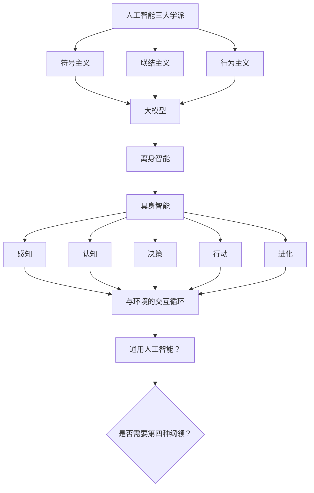

# 刘云浩《具身智能》读书笔记

> 作者：刘云浩  
> 阅读状态：进行中  
> 主线问题：通用人工智能是否需要“第四种纲领”？符号主义、联结主义、行为主义三者的融合是否足够？

[跳转到图表框架](#图表框架)

---

## 一、术语表

| 术语 | 英文 | 含义 | 相关章节 |
|---|---|---|---|
| 具身智能 | Embodied Intelligence | 智能体通过身体与环境交互而涌现的智能 | 第五章、下篇 |
| 离身智能 | Disembodied Intelligence | 不依赖身体、主要在符号或数据空间计算的智能 | 第五章 |
| 符号主义 | Symbolism | 用符号表示和逻辑推理模拟智能 | 第一章 |
| 联结主义 | Connectionism | 用神经网络从数据中学习 | 第二章 |
| 行为主义 | Behaviorism | 智能来自感知—行动循环与身体交互 | 第三章 |
| 大模型 | Large Models | 大规模预训练模型，当前 AI 的重要形态 | 第四章 |
| 感知 | Perception | 具身智能获取环境信息 | 第六章 |
| 认知 | Cognition | 理解、记忆、推理与地图构建 | 第七章 |
| 决策 | Decision | 在不确定下选择行动 | 第八章 |
| 行动 | Action | 控制身体执行动作 | 第九章 |
| 进化 | Evolution | 长期适应与能力涌现 | 第十章 |
| 自由能量原理 | Free Energy Principle | 生物体最小化预测误差的框架 | 下篇 |
| 可供性 | Affordance | 环境为行动者提供的行为可能性 | 第六章、第八章 |
| 空间智能 | Spatial Intelligence | 对空间关系的理解与操作能力 | 第七章 |
| 冗余自由度 | Redundant DoF | 机器人多自由度带来的灵活性与控制难题 | 第九章 |
| 图灵测试 | Turing Test | 判断机器是否表现出类似人类智能的对话标准 | 序言 |
| 丘奇—图灵论题 | Church–Turing Thesis | 凡有效可计算函数都可由图灵机计算 | 序言 |

---

## 二、阅读进度与导航

- [x] 序言
- [ ] 第一章 符号主义的野望
- [ ] 第二章 联结主义：从模仿到超越
- [ ] 第三章 行为主义的世界很大
- [ ] 第四章 大模型：大道之行
- [ ] 第五章 和光同尘，从离身智能到具身智能
- [ ] 第六章 感知
- [ ] 第七章 认知
- [ ] 第八章 决策
- [ ] 第九章 行动
- [ ] 第十章 进化
- [ ] 结语：模仿游戏还是进化游戏

---

## 三、章节笔记
#### 摘录
1. 我们了解某一时刻的宇宙，就能预测将来会发生什么，这就是统治了科学界数百年的因果律。（causality）（同时我读了荣格的《共时性》，这本书基本上从反面冲击了因果律）
---

### 第一章 符号主义的野望
#### 摘录
1. 符号主义学派将人的思维过程归纳为三个阶段：“如何把大象装进冰箱”
2. 专家系统是一种模仿人类专家解决问题的能力的计算机系统，主义在特定领域进行推理和判断。
---

### 第二章 联结主义：从模仿到超越
#### 摘录
1. 生成问题的一个解，通常比养正一个给定的解要花费多得多的时间，这被称为“NP难问题”。有些问题无法按照传统方式按部就班地计算出来，最好的方法是通过间接“猜算”得到答案，也就是找到一个解题的线索。这些线索或许无法直接给出答案，但可以告诉你，某个可能的结果是正还是错误的。
2. 前额叶皮质的工作主要是通过神经元的联结，每个神经元通过突触与其他神经元相连。
3. 联结主义学派的第一个法宝是“并行分布式计算”。
4. 计算机是如何实现“思考”的？
	1. 一类是单打独斗的计算，称之为串行计算。串行就是一步一步地执行计算指令，下一步指令可能会依赖上一步的结果。
	2. 并行计算
5. CPU（中央处理器）是串行计算的代表，擅长处理逻辑运算。A ==Graphics Processing Unit== (GPU) is a specialized electronic chip designed to process massive amounts of data at the same time using parallel computing.
6. CUDA is NVIDIA’s platform for accelerated computing and the foundation for GPU computing.
---

### 第三章 行为主义的世界很大

#### 摘录
1.人类处理信息分为以下四层：感知层 + 预处理层 + 认知层 + 执行层。
2.行为主义的核心理念是反馈。反馈的核心目的在于缩小系统输出与期望目标之间的偏差。

---

### 第四章 大模型：大道之行

#### 我的思考
1. 自监督学习消除了训练数据集的标注需求 传统的机器学习需要人工打标签（如：把“我喜欢这部电影”标注为“正向情感”）。而 Transformer（如 BERT、GPT）在预训练阶段使用的是**自监督学习**。不管是BERT(encoder结构)还是transformer(decoder结构)，它们的核心思想都是让文本自己成为自己的标签。在这种模式下，海量的互联网文本（网页、图书、维基百科）不需要任何人工标注，就能直接用作训练集。
2. 自注意力机制如何完美配合“免标注训练”？**自注意力机制（Transformer）提供了“能高效处理海量无标注数据”的强大架构。自注意力机制允许网络中的任意两个词直接发生联系，计算它们之间的相关性。而且完美的并行计算可以**同时处理整句话或整篇文章的所有词。
3. scaling law
4. 上下文学习（in-context learning）能力
5. 思维链（chain of thought）
#### 想动手去做：
1. LoRA大模型微调:微调调的是什么，以及怎么调，以及怎么判定调到位了
2. 强化学习怎么实践
3. MoE怎么实践
4. 顶端科学家在做什么：优化目标函数、调试超参数、设计模型架构
5. 云计算平台：大模型分布式训练，为什么需要分布式计算？
#### 摘录
  1. “自注意力机制”：你的猫正站在桌纸上，试图推倒一个装满水的杯子，而笔记本电脑就在旁边。此时，你的注意力焦点是“猫、水杯、电脑”，至于桌子上的水果、鲜花则都被虚化了。这就是“注意力机制”，即人类在漫长进化中获得的一种生存机制。“长久以来，深度学习参考的是人类的“注意力机制”，其核心目标是在众多信息中挑选与当前任务相关的重点词—— 寻求问题(输入)和答案(输出)之间的联系。”
2. 异构计算是一种在同一系统中使用多种不同处理器架构（CPU、GPU、FPGA和ASIC）的技术，这些处理器 协调工作已完成计算任务。不同处理器可以根据其特点分工协作：CPU负责通用计算和调度，GPU进行大规模并行计算，FPGA实现高效的数据预处理，ASIC完成特定的深度学习算子加速。
### 第五章 和光同尘，从离身智能到具身智能

#### 核心命题
#### 关键概念
#### 论证脉络
#### 我的思考
#### 摘录

---

### 第六章 感知

#### 核心命题
#### 关键概念
#### 论证脉络
#### 我的思考
#### 摘录

---

### 第七章 认知

#### 核心命题
#### 关键概念
#### 论证脉络
#### 我的思考
#### 摘录

---

### 第八章 决策

#### 核心命题
#### 关键概念
#### 论证脉络
#### 我的思考
#### 摘录

---

### 第九章 行动

#### 核心命题
#### 关键概念
#### 论证脉络
#### 我的思考
#### 摘录

---

### 第十章 进化

#### 核心命题
#### 关键概念
#### 论证脉络
#### 我的思考
#### 摘录

---

### 结语：模仿游戏还是进化游戏

#### 核心命题
#### 关键概念
#### 论证脉络
#### 我的思考
#### 摘录

---

## 四、图表框架

